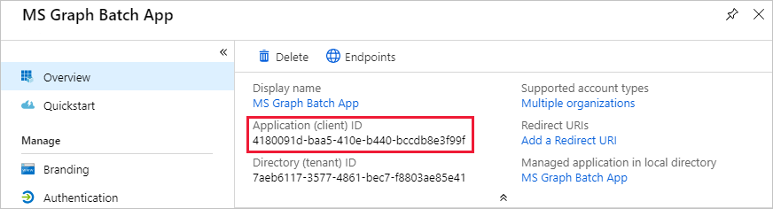
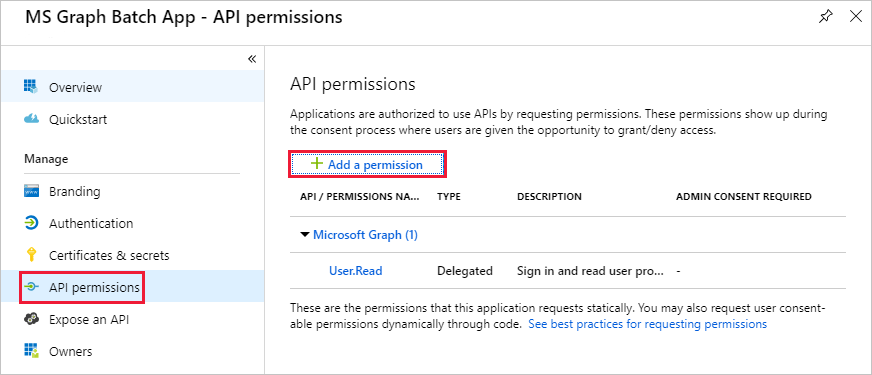

<!-- markdownlint-disable MD002 MD041 -->

В этом упражнении вы создадите новое приложение Azure Active Directory, которое будет использоваться для предоставления делегированных разрешений для настраиваемого соединителя.

Откройте браузер и перейдите в [центр администрирования Azure Active Directory](https://aad.portal.azure.com). Выберите ссылку **Azure Active Directory** в левом меню навигации, а затем выберите запись **регистрации приложений** в разделе **Управление** в колонке **Azure Active Directory** .

Выберите новый элемент меню **Регистрация** в верхней части колонки **Регистрация приложений** .

Введите `MS Graph Batch App` в поле **имя** . В разделе **Поддерживаемые типы учетных записей** выберите **учетные записи в любом организационном каталоге**. Оставьте незаполненным раздел **URI перенаправления** и выберите **регистр**.

В колонке **Пакетное приложение MS Graph** скопируйте **идентификатор Application (Client)**. Это потребуется в следующем упражнении.

Выберите элемент **разрешения API** в разделе **Управление** в колонке **пакетного приложения MS Graph** . Выберите **Добавить разрешение** в разделе **разрешения для API**.

В колонке **запрос API разрешений** выберите **Microsoft Graph** , а затем — **делегированные разрешения**. Выполните поиск `group` , а затем выберите разрешение **чтение и запись всех групп** , делегированные разрешения. В нижней части блейд-сайта выберите **Добавить разрешения** .

 

Выберите " **Сертификаты и секреты** " в разделе **Управление** в колонке **пакетного приложения MS Graph** , а затем выберите **новый секрет клиента**. Введите `forever` в поле **Описание** и выберите пункт **никогда** в разделе **срок действия**. Нажмите кнопку **Добавить**.

Скопируйте значение для нового секрета. Это потребуется в следующем упражнении.

> [!IMPORTANT]
> Этот шаг является критическим, так как секрет будет недоступен после закрытия этой колонки. Сохраните этот секрет в текстовом редакторе, чтобы использовать его в предстоящих упражнениях.

Чтобы включить управление дополнительными службами через Microsoft Graph, в том числе свойства Teams, необходимо выбрать дополнительные, соответствующие области, чтобы разрешить управление определенными службами. Например, чтобы расширить решение для создания записных книжек OneNote или планов планировщика, сегментов и задач, необходимо добавить необходимые области разрешений для соответствующих API.
