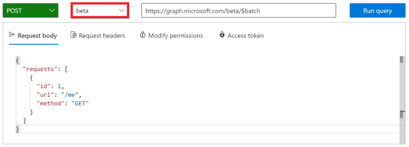

<!-- markdownlint-disable MD002 MD041 -->

Прежде чем создавать потоки для использования нового соединителя, воспользуйтесь [проводником Microsoft Graph](https://developer.microsoft.com/graph/graph-explorer) , чтобы узнать о некоторых возможностях и возможностях пакетной обработки JSON в Microsoft Graph.

Откройте [обозреватель Microsoft Graph](https://developer.microsoft.com/graph/graph-explorer) в браузере. Войдите с помощью учетной записи администратора клиента Office 365. Выполните поиск для **пакета** в **запросах с примерами**.

В меню слева выберите пункт **выполнение параллельных операций Get** . Нажмите кнопку **выполнить запрос** в правом верхнем углу экрана.


Пример пакетной операции получает три запроса HTTP GET и отправляет один HTTP-POST в `/v1.0/$batch` конечную точку Graph.

```json
{
    "requests": [
        {
            "url": "/me?$select=displayName,jobTitle,userPrincipalName",
            "method": "GET",
            "id": "1"
        },
        {
            "url": "/me/messages?$filter=importance eq 'high'&$select=from,subject,receivedDateTime,bodyPreview",
            "method": "GET",
            "id": "2"
        },
        {
            "url": "/me/events",
            "method": "GET",
            "id": "3"
        }
    ]
}
```

Возвращенный ответ показан ниже. Обратите внимание на массив ответов, возвращаемый Microsoft Graph. Ответы на пакетные запросы могут отображаться в порядке, отличном от порядка запросов в POST. `id`Свойство следует использовать для сопоставления отдельных пакетных запросов с конкретными пакетными ответами.

> [!NOTE]
> Ответ был усечен для удобочитаемости.

```json
{
  "responses": [
    {
      "id": "1",
      "status": 200,
      "headers": {...},
      "body": {...}
    },
    {
      "id": "3",
      "status": 200,
      "headers": {...},
      "body": {...}
    }
    {
      "id": "2",
      "status": 200,
      "headers": {...},
      "body": {...}
    }
  ]
}
```

Каждый ответ содержит `id` свойство, `status` , `headers` и `body` . Если `status` свойство для запроса указывает на сбой, оно `body` содержит все сведения об ошибке, возвращенные из запроса.

Чтобы обеспечить порядок операций для запросов, отдельные запросы можно упорядочивать с помощью свойства [dependsOn](https://docs.microsoft.com/graph/json-batching#sequencing-requests-with-the-dependson-property) .

В дополнение к операциям виртуализации и зависимости, пакетная обработка JSON предполагает базовый путь и выполняет запросы из относительного пути. Каждый элемент пакетного запроса выполняется из `/v1.0/$batch` `/beta/$batch` указанных конечных точек. Это может привести к значительным различиям, так как `/beta` Конечная точка может вернуть дополнительные выходные данные, которые не могут быть возвращены в `/v1.0` конечной точке.

Например, выполните следующие два запроса в [проводнике Microsoft Graph](https://developer.microsoft.com/graph/graph-explorer).

1. Запросите `/v1.0/$batch` конечную точку, используя URL-адрес `/me` (скопируйте и вставьте запрос ниже).

```json
{
  "requests": [
    {
      "id": 1,
      "url": "/me",
      "method": "GET"
    }
  ]
}
```


Теперь используйте раскрывающееся раскрывающийся список выбора версии, чтобы перейти на `beta` конечную точку и выполнить точно такой же запрос.



Каковы различия в возвращаемых результатах? Попробуйте выполнить другие запросы, чтобы определить некоторые различия.

В дополнение к разным ответным содержимому `/v1.0` `/beta` , связанному с конечными точками, важно понимать возможные ошибки при выполнении пакетного запроса, для которого не предоставлено согласие на разрешение. Например, элемент пакетного запроса для создания записной книжки OneNote.

```json
{
  "id": 1,
  "url": "/groups/65c5ecf9-3311-449c-9904-29a2c76b9a50/onenote/notebooks",
  "headers": {
    "Content-Type": "application/json"
  },
  "method": "POST",
  "body": {
    "displayName": "Meeting Notes"
  }
}
```

Однако если разрешения на создание записных книжек OneNote не предоставлены, будет получен следующий ответ. Обратите внимание на код состояния `403 (Forbidden)` и сообщение об ошибке, которое указывает, что указанный маркер OAuth не включает области, необходимые для выполнения запрошенного действия.

```json
{
  "responses": [
    {
      "id": "1",
      "status": 403,
      "headers": {
        "Cache-Control": "no-cache"
      },
      "body": {
        "error": {
          "code": "40004",
          "message": "The OAuth token provided does not have the necessary scopes to complete the request.
            Please make sure you are including one or more of the following scopes: Notes.ReadWrite.All,
            Notes.Read.All (you provided these scopes: Group.Read.All,Group.ReadWrite.All,User.Read,User.Read.All)",
          "innerError": {
            "request-id": "92d50317-aa06-4bd7-b908-c85ee4eff0e9",
            "date": "2018-10-17T02:01:10"
          }
        }
      }
    }
  ]
}
```

Каждый запрос в пакете будет возвращать код состояния и результаты или сведения об ошибке. Необходимо обработать каждый из ответов, чтобы определить успешность или сбой отдельных пакетных операций.
