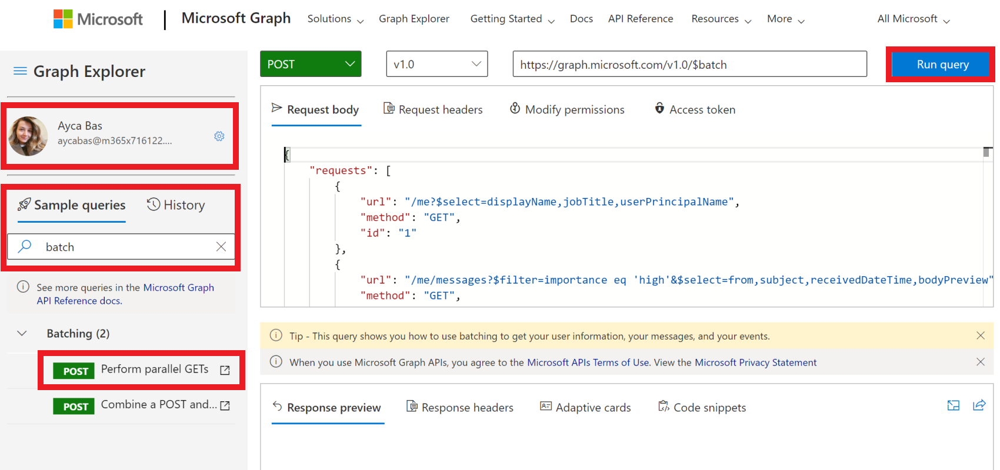

<!-- markdownlint-disable MD002 MD041 -->

<span data-ttu-id="1e743-101">Прежде чем создавать потоки для использования нового соединителя, воспользуйтесь [проводником Microsoft Graph](https://developer.microsoft.com/graph/graph-explorer) , чтобы узнать о некоторых возможностях и возможностях пакетной обработки JSON в Microsoft Graph.</span><span class="sxs-lookup"><span data-stu-id="1e743-101">Before creating a Flow to consume the new connector, use [Microsoft Graph Explorer](https://developer.microsoft.com/graph/graph-explorer) to discover some of the capabilities and features of JSON batching in Microsoft Graph.</span></span>

<span data-ttu-id="1e743-102">Откройте [обозреватель Microsoft Graph](https://developer.microsoft.com/graph/graph-explorer) в браузере.</span><span class="sxs-lookup"><span data-stu-id="1e743-102">Open the [Microsoft Graph Explorer](https://developer.microsoft.com/graph/graph-explorer) in your browser.</span></span> <span data-ttu-id="1e743-103">Войдите с помощью учетной записи администратора клиента Office 365.</span><span class="sxs-lookup"><span data-stu-id="1e743-103">Sign in with your Office 365 tenant administrator account.</span></span> <span data-ttu-id="1e743-104">Выполните поиск для **пакета** в **запросах с примерами**.</span><span class="sxs-lookup"><span data-stu-id="1e743-104">Search for for **Batch** from the **Sample queries**.</span></span>

<span data-ttu-id="1e743-105">В меню слева выберите пункт **выполнение параллельных операций Get** .</span><span class="sxs-lookup"><span data-stu-id="1e743-105">Select the **Perform parallel GETs** sample query in the left menu.</span></span> <span data-ttu-id="1e743-106">Нажмите кнопку **выполнить запрос** в правом верхнем углу экрана.</span><span class="sxs-lookup"><span data-stu-id="1e743-106">Choose the **Run Query** button at the top right of the screen.</span></span>



<span data-ttu-id="1e743-108">Пример пакетной операции получает три запроса HTTP GET и отправляет один HTTP-POST в `/v1.0/$batch` конечную точку Graph.</span><span class="sxs-lookup"><span data-stu-id="1e743-108">The sample batch operation batches three HTTP GET requests and issues a single HTTP POST to the `/v1.0/$batch` Graph endpoint.</span></span>

```json
{
    "requests": [
        {
            "url": "/me?$select=displayName,jobTitle,userPrincipalName",
            "method": "GET",
            "id": "1"
        },
        {
            "url": "/me/messages?$filter=importance eq 'high'&$select=from,subject,receivedDateTime,bodyPreview",
            "method": "GET",
            "id": "2"
        },
        {
            "url": "/me/events",
            "method": "GET",
            "id": "3"
        }
    ]
}
```

<span data-ttu-id="1e743-109">Возвращенный ответ показан ниже.</span><span class="sxs-lookup"><span data-stu-id="1e743-109">The response returned is shown below.</span></span> <span data-ttu-id="1e743-110">Обратите внимание на массив ответов, возвращаемый Microsoft Graph.</span><span class="sxs-lookup"><span data-stu-id="1e743-110">Note the array of responses that is returned by Microsoft Graph.</span></span> <span data-ttu-id="1e743-111">Ответы на пакетные запросы могут отображаться в порядке, отличном от порядка запросов в POST.</span><span class="sxs-lookup"><span data-stu-id="1e743-111">The responses to the batched requests may appear in a different order than the order of the requests in the POST.</span></span> <span data-ttu-id="1e743-112">`id`Свойство следует использовать для сопоставления отдельных пакетных запросов с конкретными пакетными ответами.</span><span class="sxs-lookup"><span data-stu-id="1e743-112">The `id` property should be used to correlate individual batch requests with specific batch responses.</span></span>

> [!NOTE]
> <span data-ttu-id="1e743-113">Ответ был усечен для удобочитаемости.</span><span class="sxs-lookup"><span data-stu-id="1e743-113">The response has been truncated for readability.</span></span>

```json
{
  "responses": [
    {
      "id": "1",
      "status": 200,
      "headers": {...},
      "body": {...}
    },
    {
      "id": "3",
      "status": 200,
      "headers": {...},
      "body": {...}
    }
    {
      "id": "2",
      "status": 200,
      "headers": {...},
      "body": {...}
    }
  ]
}
```

<span data-ttu-id="1e743-114">Каждый ответ содержит `id` свойство, `status` , `headers` и `body` .</span><span class="sxs-lookup"><span data-stu-id="1e743-114">Each response contains an `id`, `status`, `headers`, and `body` property.</span></span> <span data-ttu-id="1e743-115">Если `status` свойство для запроса указывает на сбой, оно `body` содержит все сведения об ошибке, возвращенные из запроса.</span><span class="sxs-lookup"><span data-stu-id="1e743-115">If the `status` property for a request indicates a failure, the `body` contains any error information returned from the request.</span></span>

<span data-ttu-id="1e743-116">Чтобы обеспечить порядок операций для запросов, отдельные запросы можно упорядочивать с помощью свойства [dependsOn](https://docs.microsoft.com/graph/json-batching#sequencing-requests-with-the-dependson-property) .</span><span class="sxs-lookup"><span data-stu-id="1e743-116">To ensure an order of operations for the requests, individual requests can be sequenced using the [dependsOn](https://docs.microsoft.com/graph/json-batching#sequencing-requests-with-the-dependson-property) property.</span></span>

<span data-ttu-id="1e743-117">В дополнение к операциям виртуализации и зависимости, пакетная обработка JSON предполагает базовый путь и выполняет запросы из относительного пути.</span><span class="sxs-lookup"><span data-stu-id="1e743-117">In addition to sequencing and dependency operations, JSON batching assumes a base path and executes the requests from a relative path.</span></span> <span data-ttu-id="1e743-118">Каждый элемент пакетного запроса выполняется из `/v1.0/$batch` `/beta/$batch` указанных конечных точек.</span><span class="sxs-lookup"><span data-stu-id="1e743-118">Each batch request element is executed from either the `/v1.0/$batch` OR `/beta/$batch` endpoints as specified.</span></span> <span data-ttu-id="1e743-119">Это может привести к значительным различиям, так как `/beta` Конечная точка может вернуть дополнительные выходные данные, которые не могут быть возвращены в `/v1.0` конечной точке.</span><span class="sxs-lookup"><span data-stu-id="1e743-119">This can have significant differences as the `/beta` endpoint may return additional output which may NOT be returned in the `/v1.0` endpoint.</span></span>

<span data-ttu-id="1e743-120">Например, выполните следующие два запроса в [проводнике Microsoft Graph](https://developer.microsoft.com/graph/graph-explorer).</span><span class="sxs-lookup"><span data-stu-id="1e743-120">For example, execute the following two queries in the [Microsoft Graph Explorer](https://developer.microsoft.com/graph/graph-explorer).</span></span>

1. <span data-ttu-id="1e743-121">Запросите `/v1.0/$batch` конечную точку, используя URL-адрес `/me` (скопируйте и вставьте запрос ниже).</span><span class="sxs-lookup"><span data-stu-id="1e743-121">Query the `/v1.0/$batch` endpoint using the url `/me` (copy and paste request below).</span></span>

```json
{
  "requests": [
    {
      "id": 1,
      "url": "/me",
      "method": "GET"
    }
  ]
}
```


<span data-ttu-id="1e743-123">Теперь используйте раскрывающееся раскрывающийся список выбора версии, чтобы перейти на `beta` конечную точку и выполнить точно такой же запрос.</span><span class="sxs-lookup"><span data-stu-id="1e743-123">Now use the version selector drop-down to change to the `beta` endpoint, and make the exact same request.</span></span>


<span data-ttu-id="1e743-125">Каковы различия в возвращаемых результатах?</span><span class="sxs-lookup"><span data-stu-id="1e743-125">What are the differences in the results returned?</span></span> <span data-ttu-id="1e743-126">Попробуйте выполнить другие запросы, чтобы определить некоторые различия.</span><span class="sxs-lookup"><span data-stu-id="1e743-126">Try some other queries to identify some of the differences.</span></span>

<span data-ttu-id="1e743-127">В дополнение к разным ответным содержимому `/v1.0` `/beta` , связанному с конечными точками, важно понимать возможные ошибки при выполнении пакетного запроса, для которого не предоставлено согласие на разрешение.</span><span class="sxs-lookup"><span data-stu-id="1e743-127">In addition to different response content from the `/v1.0` and `/beta` endpoints, it is important to understand the possible errors when a batch request is made for which permission consent has not been granted.</span></span> <span data-ttu-id="1e743-128">Например, элемент пакетного запроса для создания записной книжки OneNote.</span><span class="sxs-lookup"><span data-stu-id="1e743-128">For example, the following is a batch request item to create a OneNote Notebook.</span></span>

```json
{
  "id": 1,
  "url": "/groups/65c5ecf9-3311-449c-9904-29a2c76b9a50/onenote/notebooks",
  "headers": {
    "Content-Type": "application/json"
  },
  "method": "POST",
  "body": {
    "displayName": "Meeting Notes"
  }
}
```

<span data-ttu-id="1e743-129">Однако если разрешения на создание записных книжек OneNote не предоставлены, будет получен следующий ответ.</span><span class="sxs-lookup"><span data-stu-id="1e743-129">However, if the permissions to create OneNote Notebooks has not been granted, the following response is received.</span></span> <span data-ttu-id="1e743-130">Обратите внимание на код состояния `403 (Forbidden)` и сообщение об ошибке, которое указывает, что указанный маркер OAuth не включает области, необходимые для выполнения запрошенного действия.</span><span class="sxs-lookup"><span data-stu-id="1e743-130">Note the status code `403 (Forbidden)` and the error message which indicates the OAuth token provided does not include the scopes required to completed the requested action.</span></span>

```json
{
  "responses": [
    {
      "id": "1",
      "status": 403,
      "headers": {
        "Cache-Control": "no-cache"
      },
      "body": {
        "error": {
          "code": "40004",
          "message": "The OAuth token provided does not have the necessary scopes to complete the request.
            Please make sure you are including one or more of the following scopes: Notes.ReadWrite.All,
            Notes.Read.All (you provided these scopes: Group.Read.All,Group.ReadWrite.All,User.Read,User.Read.All)",
          "innerError": {
            "request-id": "92d50317-aa06-4bd7-b908-c85ee4eff0e9",
            "date": "2018-10-17T02:01:10"
          }
        }
      }
    }
  ]
}
```

<span data-ttu-id="1e743-131">Каждый запрос в пакете будет возвращать код состояния и результаты или сведения об ошибке.</span><span class="sxs-lookup"><span data-stu-id="1e743-131">Each request in your batch will return a status code and results or error information.</span></span> <span data-ttu-id="1e743-132">Необходимо обработать каждый из ответов, чтобы определить успешность или сбой отдельных пакетных операций.</span><span class="sxs-lookup"><span data-stu-id="1e743-132">You must process each of the responses in order to determine success or failure of the individual batch operations.</span></span>
