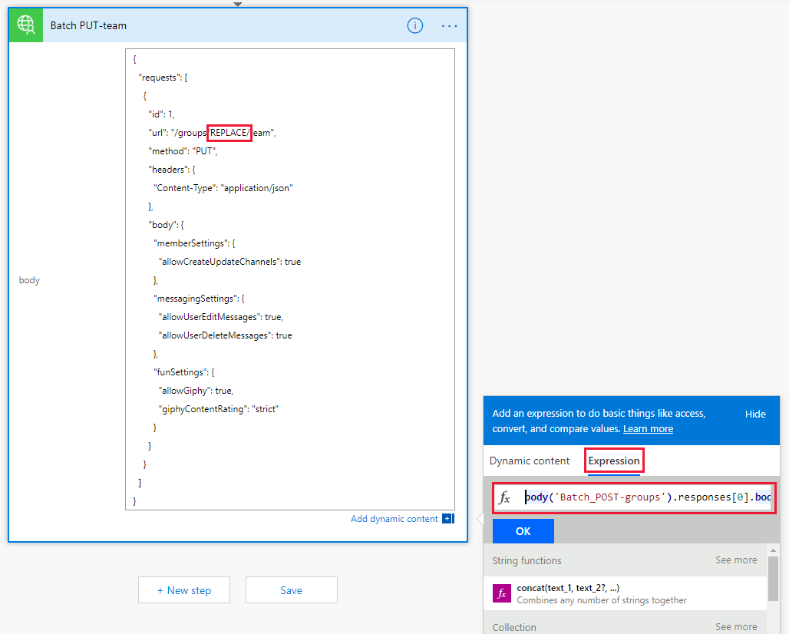

<!-- markdownlint-disable MD002 MD041 -->

<span data-ttu-id="42d85-101">В этом упражнении вы создадите последовательность для использования настраиваемого соединителя, созданного в предыдущих упражнениях, для создания и настройки группы Майкрософт.</span><span class="sxs-lookup"><span data-stu-id="42d85-101">In this exercise, you will create a flow to use the custom connector you created in previous exercises to create and configure a Microsoft Team.</span></span> <span data-ttu-id="42d85-102">Этот процесс использует настраиваемый соединитель для отправки запроса POST на создание единой группы Office 365, приостанавливается на задержку при завершении создания группы, а затем отправляет запрос PUT для связи группы с командой Майкрософт.</span><span class="sxs-lookup"><span data-stu-id="42d85-102">The flow will use the custom connector to send a POST request to create an Office 365 Unified Group, will pause for a delay while the group creation completes, and then will send a PUT request to associate the group with a Microsoft Team.</span></span>

<span data-ttu-id="42d85-103">В конце ваш процесс будет выглядеть примерно так, как показано на следующем рисунке:</span><span class="sxs-lookup"><span data-stu-id="42d85-103">In the end your flow will look similar to the following image:</span></span>


<span data-ttu-id="42d85-105">Откройте [Microsoft Power автоматизирует](https://flow.microsoft.com) в браузере и войдите в систему с помощью учетной записи администратора клиента Office 365.</span><span class="sxs-lookup"><span data-stu-id="42d85-105">Open [Microsoft Power Automate](https://flow.microsoft.com) in your browser and sign in with your Office 365 tenant administrator account.</span></span> <span data-ttu-id="42d85-106">Выберите пункт **мои потоки** в левой панели навигации.</span><span class="sxs-lookup"><span data-stu-id="42d85-106">Choose **My flows** in the left-hand navigation.</span></span> <span data-ttu-id="42d85-107">Выберите **создать** , а затем — **с пустым**.</span><span class="sxs-lookup"><span data-stu-id="42d85-107">Choose **New** , then **Instant--from blank**.</span></span> <span data-ttu-id="42d85-108">Введите `Create Team` для параметра **имя процесса** , а затем выберите **Запуск процесса вручную** в разделе **выберите способ активации этого процесса**.</span><span class="sxs-lookup"><span data-stu-id="42d85-108">Enter `Create Team` for **Flow name** , then select **Manually trigger a flow** under **Choose how to trigger this flow**.</span></span> <span data-ttu-id="42d85-109">Нажмите **Создать**.</span><span class="sxs-lookup"><span data-stu-id="42d85-109">Choose **Create**.</span></span>

<span data-ttu-id="42d85-110">Выберите **ручной запуск элемента Flow** , а затем нажмите кнопку **Добавить вход** , выберите **текст** и введите `Name` название.</span><span class="sxs-lookup"><span data-stu-id="42d85-110">Select the **Manually trigger a flow** item, then choose **Add an input** , select **Text** and enter `Name` as the title.</span></span>


<span data-ttu-id="42d85-112">Выберите **новый шаг** и введите `Batch` в поле поиска.</span><span class="sxs-lookup"><span data-stu-id="42d85-112">Choose **New step** and type `Batch` in the search box.</span></span> <span data-ttu-id="42d85-113">Добавьте действие **пакетного соединителя MS Graph** .</span><span class="sxs-lookup"><span data-stu-id="42d85-113">Add the **MS Graph Batch Connector** action.</span></span> <span data-ttu-id="42d85-114">Нажмите кнопку с многоточием и переименуйте это действие в `Batch POST-groups` .</span><span class="sxs-lookup"><span data-stu-id="42d85-114">Choose the ellipsis and rename this action to `Batch POST-groups`.</span></span>

<span data-ttu-id="42d85-115">Добавьте следующий код в поле **основного** текста действия.</span><span class="sxs-lookup"><span data-stu-id="42d85-115">Add the following code into the **body** text box of the action.</span></span>

```json
{
  "requests": [
    {
      "url": "/groups",
      "method": "POST",
      "id": 1,
      "headers": { "Content-Type": "application/json" },
      "body": {
        "description": "REPLACE",
        "displayName": "REPLACE",
        "groupTypes": ["Unified"],
        "mailEnabled": true,
        "mailNickname": "REPLACE",
        "securityEnabled": false
      }
    }
  ]
}
```

<span data-ttu-id="42d85-116">Замените каждый `REPLACE` заполнитель, выбрав `Name` значение из триггера вручную в меню **Добавление динамического содержимого** .</span><span class="sxs-lookup"><span data-stu-id="42d85-116">Replace each `REPLACE` placeholder by selecting the `Name` value from the manual trigger from the **Add dynamic content** menu.</span></span>


<span data-ttu-id="42d85-118">Выберите **новый шаг** , поиск `delay` и Добавление действия **задержки** и настройка в течение 1 минуты.</span><span class="sxs-lookup"><span data-stu-id="42d85-118">Choose **New step** , search for `delay` and add a **Delay** action and configure for 1 minute.</span></span>

<span data-ttu-id="42d85-119">Выберите **новый шаг** и введите `Batch` в поле поиска.</span><span class="sxs-lookup"><span data-stu-id="42d85-119">Choose **New step** and type `Batch` in the search box.</span></span> <span data-ttu-id="42d85-120">Добавьте действие **пакетного соединителя MS Graph** .</span><span class="sxs-lookup"><span data-stu-id="42d85-120">Add the **MS Graph Batch Connector** action.</span></span> <span data-ttu-id="42d85-121">Нажмите кнопку с многоточием и переименуйте это действие в `Batch PUT-team` .</span><span class="sxs-lookup"><span data-stu-id="42d85-121">Choose the ellipsis and rename this action to `Batch PUT-team`.</span></span>

<span data-ttu-id="42d85-122">Добавьте следующий код в поле **основного** текста действия.</span><span class="sxs-lookup"><span data-stu-id="42d85-122">Add the following code into the **body** text box of the action.</span></span>

```json
{
  "requests": [
    {
      "id": 1,
      "url": "/groups/REPLACE/team",
      "method": "PUT",
      "headers": {
        "Content-Type": "application/json"
      },
      "body": {
        "memberSettings": {
          "allowCreateUpdateChannels": true
        },
        "messagingSettings": {
          "allowUserEditMessages": true,
          "allowUserDeleteMessages": true
        },
        "funSettings": {
          "allowGiphy": true,
          "giphyContentRating": "strict"
        }
      }
    }
  ]
}
```

<span data-ttu-id="42d85-123">Выберите `REPLACE` заполнитель, а затем выберите **выражение** в области динамический контент.</span><span class="sxs-lookup"><span data-stu-id="42d85-123">Select the `REPLACE` placeholder, then select **Expression** in the dynamic content pane.</span></span> <span data-ttu-id="42d85-124">Добавьте в **выражение** следующую формулу.</span><span class="sxs-lookup"><span data-stu-id="42d85-124">Add the following formula into the **Expression**.</span></span>

```js
body('Batch_POST-groups').responses[0].body.id
```



<span data-ttu-id="42d85-126">Эта формула указывает, что мы хотим использовать идентификатор группы из результата первого действия.</span><span class="sxs-lookup"><span data-stu-id="42d85-126">This formula specifies that we want to use the group ID from the result of the first action.</span></span>


<span data-ttu-id="42d85-128">Нажмите кнопку **сохранить** , а затем выберите пункт **тест** для выполнения последовательности.</span><span class="sxs-lookup"><span data-stu-id="42d85-128">Choose **Save** , then choose **Test** to execute the flow.</span></span>

> [!TIP]
> <span data-ttu-id="42d85-129">Если возникнет ошибка `The template validation failed: 'The action(s) 'Batch_POST-groups' referenced by 'inputs' in action 'Batch_2' are not defined in the template'` , выражение является неверным и, скорее всего, ссылается на действие, которое не удается найти.</span><span class="sxs-lookup"><span data-stu-id="42d85-129">If you receive an error like `The template validation failed: 'The action(s) 'Batch_POST-groups' referenced by 'inputs' in action 'Batch_2' are not defined in the template'`, the expression is incorrect and likely references a flow action it cannot find.</span></span> <span data-ttu-id="42d85-130">Убедитесь, что имя действия, на которое вы ссылаетесь, соответствует точно.</span><span class="sxs-lookup"><span data-stu-id="42d85-130">Ensure that the action name you are referencing matches exactly.</span></span>

<span data-ttu-id="42d85-131">Выберите переключатель **я выполню действие триггера** и нажмите кнопку **сохранить & тест**.</span><span class="sxs-lookup"><span data-stu-id="42d85-131">Choose the **I'll perform the trigger** action radio button and choose **Save & Test**.</span></span> <span data-ttu-id="42d85-132">Нажмите кнопку **продолжить** в диалоговом окне.</span><span class="sxs-lookup"><span data-stu-id="42d85-132">Choose **Continue** in the dialog.</span></span> <span data-ttu-id="42d85-133">Введите имя без пробелов и выберите команду **выполнить поток** для создания команды.</span><span class="sxs-lookup"><span data-stu-id="42d85-133">Provide a name without spaces, and choose **Run flow** to create a Team.</span></span>


<span data-ttu-id="42d85-135">Наконец, нажмите кнопку **Готово** , чтобы просмотреть журнал действий.</span><span class="sxs-lookup"><span data-stu-id="42d85-135">Finally, choose the **Done** to see the activity log.</span></span> <span data-ttu-id="42d85-136">По завершении процесса вы настроили группу и команду Office 365.</span><span class="sxs-lookup"><span data-stu-id="42d85-136">Once the flow completes, your Office 365 Group and Team have been configured.</span></span> <span data-ttu-id="42d85-137">Выберите элементы пакетного действия, чтобы просмотреть результаты пакетных вызовов JSON.</span><span class="sxs-lookup"><span data-stu-id="42d85-137">Select the Batch action items to view the results of the JSON Batch calls.</span></span> <span data-ttu-id="42d85-138">`outputs` `Batch PUT-team` Действие должно иметь код состояния 201 для успешного сопоставления команды, как показано на рисунке ниже.</span><span class="sxs-lookup"><span data-stu-id="42d85-138">The `outputs` of the `Batch PUT-team` action should have a status code of 201 for a successful Team association similar to the image below.</span></span>


